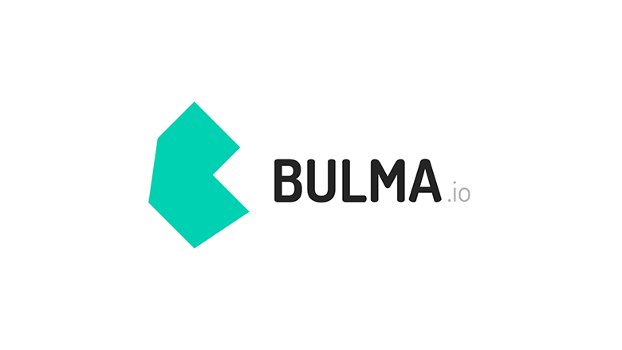
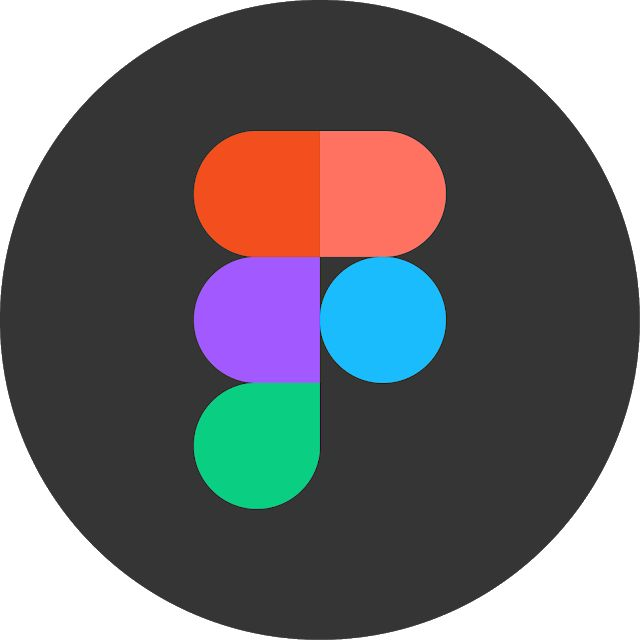

<a class="badge-base__link LI-simple-link" href="https://twitter.com/rengvsed"> Arowolo David Oluwatosin</a>

    
<h1>TOSIN's WORLD 😎</h1>

### **What's my current role in tech?** </h2>

       { fullStackDeveloper }

#### Connect with me

#### About me

Here are some basic things to know about TOSIN 😎🏾‍♂️;

- 😎 My name is Arowolo David Oluwatosin.
- 💻 I am intrigued by the web and how it works. I always try to be in line with the lastest web technologies and how it works. - 🔭 I’m currently working on acquiring new skills,
- 🌱 I’m currently learning Fullstack Web Development,
- 👯 I’m looking to collaborate on projects,
- 📫 How to reach me: Email: Teedave2203@gmail.com, Phone: +2349022645378,
- 😄 Pronouns: He/Him/His,
- ⚡ Fun fact:
- 🎨 I dabble into digital art every now and then.
- 🎵 music is like a free zone for me.
- 🇨🇳 I speak chinese.

#### My Core Languages

<code></code>
<code></code>
<code></code>
<code></code>

#### Frameworks I Use

<code></code>
<code></code>
<code></code>
<code></code>
<code></code>
<code></code>
<code></code>

#### Tools I Use

<code></code>
<code></code>
<code></code>
<code></code>
<code></code>
<code></code>
<code></code>
<code></code>

